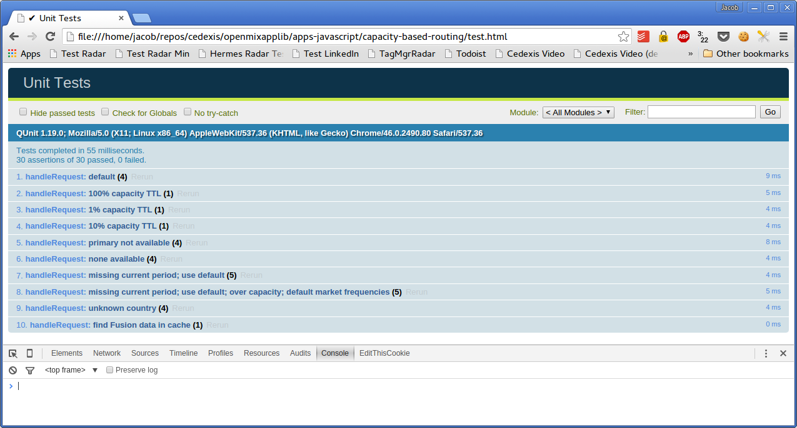

# Routing Based on Likely POP Sample Rate With Failover to Alternate Providers

This application routes between a primary provider and a set of alternate providers.  A custom Fusion feed is used to determine the current desired sample rate for each of the primary provider's POPs, as well as the most likely POP to be selected for each country.  The application uses the sample rate of the likely POP for each request's country to determine whether to route to the primary provider.  If the application decides not to sample the primary provider, then it routes to one of the alternate providers.

The application routes to the alternate providers based on a weighted distribution that is configurable by continent.

Radar data is used to avoid routing to providers that may be unavailable, although this feature is easily disabled via configuration.

When routing to the primary provider, the TTL is scaled according to the current sample rate of the likely POP and configurable minimum and maximum values.

## Fusion Feed

Here's a simplified example of the Fusion feed used by the app.

```json
{
    "countries": {
        "CA": "SJC",
        "IN": "AMS",
        "US": "DFW"
    },
    "default": {
        "AMS": 75,
        "DFW": 75,
        "LHR": 75,
        "SJC": 75
    },
    "periods": {
        "2015-11-05T03": {
            "AMS": 93,
            "DFW": 93,
            "LHR": 77,
            "SJC": 79
        },
        "2015-11-05T04": {
            "AMS": 86,
            "DFW": 86,
            "LHR": 92,
            "SJC": 79
        },
        "2015-11-05T05": {
            "AMS": 88,
            "DFW": 86,
            "LHR": 87,
            "SJC": 97
        },
        "2015-11-05T06": {
            "AMS": 76,
            "DFW": 100,
            "LHR": 87,
            "SJC": 87
        },
        "2015-11-05T07": {
            "AMS": 80,
            "DFW": 95,
            "LHR": 92,
            "SJC": 75
        }
    }
}
```

This JSON object contains three keyed objects: *countries*, *periods* and *default*.

The *countries* key points to an object whose keys are [ISO 3166-1 alpha-2](https://en.wikipedia.org/wiki/ISO_3166-1_alpha-2) country codes.  Each maps to the most likely POP to handle requests for that country.

The *periods* key points to an object whose keys are [ISO 8601](https://en.wikipedia.org/wiki/ISO_8601) formatted date strings truncated to the hour.  Each points to another object mapping POPs to the desired sample rate for that hour.

In the event that the Fusion feed gets out of date and the current hour is not found, the application uses the POP sample rates found in the *default* object.

### Configuration

The application itself contains several configurable options.  These are contained in the `appConfig` variable defined at the top of the app.js file, reproduced below for convenience:

```javascript
var appConfig = {
    providers: {
        'primary': {
            cname: 'foo.primary.com'
        },
        'alternate_a': {
            cname: 'foo.alternate-a.com'
        },
        'alternate_b': {
            cname: 'foo.alternate-b.com'
        }
    },
    fusionFeedProvider: 'fusion_feed',
    defaultProvider: 'primary',
    defaultTTL: 60, // the TTL when one of the alternate provides is selected
    minTTL: 20, // the (theoretical) TTL when the likely POP sample rate is 0%
    maxTTL: 600, // the TTL when the likely POP sample rate is 100%
    availabilityThreshold: 90,
    marketWeights: {
        'AS': {
            'alternate_a': 90,
            'alternate_b': 10
        },
        'NA': {
            'alternate_a': 25,
            'alternate_b': 75
        }
    },
    defaultMarketWeights: {
        'alternate_a': 50,
        'alternate_b': 50
    }
};
```

The *providers* setting is an object whose keys are the *Openmix aliases* of the primary and alternate providers used by the app.  Each points to an object containing properties related to that provider.  For now, the only property is *cname*, which should be set to the desired CNAME answer for each provider.

The *fusionFeedProvider* property is the Openmix alias of the provider associated with the Fusion feed.

The *defaultProvider* property is the Openmix alias of the primary provider.  It should match one of the keys in the *providers* object.

The *defaultTTL* property is the TTL to be set when selecting one of the alternate providers.

When selecting the primary provider, *maxTTL* and *minTTL* are used to scale the TTL depending on the current sample rate of the likely POP.

The *availabilityThreshold* setting is the minimum Radar availability score that a provider must have in order to be considered a candidate for selection.  Setting this to zero effectively disables Radar availability checking.

The *marketWeights* setting is an object mapping market codes (NA, SA, EU, AF, AS, and OC) to another object that maps the alternative providers to the desired *weight* relative to one another.  These are weights, not percentages, but you can make them appear to be percentages by making sure they add up to 100 for each market.

The *defaultMarketWeights* setting is provided for convenience.  If the market for the current request is not found in the *marketWeights* object, then these weights will be used instead.

## Linting and Unit Testing

The project includes a Makefile with targets for validation and testing of the application code.

### Prerequesites

* make
* npm (the Node Package Manager)
* Java

npm is included in Node.js, which can be installed using the package installer for your system (visit https://nodejs.org/en/download/).

Any recent version of Java should suffice.

Use npm to download the necessary Node runtime packages by executing the following command from the directory containing the application's package.json file:

```bash
$ npm install
```

### Command Line Linting

To run the validation task:

```bash
$ make validate
```

### Command Line Unit Tests

To run the unit tests from the command line:

```bash
$ make test
04 11 2015 15:18:03.340:INFO [karma]: Karma v0.13.15 server started at http://localhost:9877/
04 11 2015 15:18:03.346:INFO [launcher]: Starting browser PhantomJS
04 11 2015 15:18:03.523:INFO [PhantomJS 1.9.8 (Linux 0.0.0)]: Connected on socket X_hW75IxmqxGOUbEAAAA with id 3824898
PhantomJS 1.9.8 (Linux 0.0.0): Executed 10 of 10 SUCCESS (0.042 secs / 0.013 secs)
```

### HTML Unit Test Page

You can also run the unit tests in the browser by visiting the test.html file, which is located in the same directory as the application's app.js file, using the `file:///path to test.html` URL.  This is useful for debugging, as you have access to the browser's development tools as the tests run.  You can set breakpoints and view console output.


